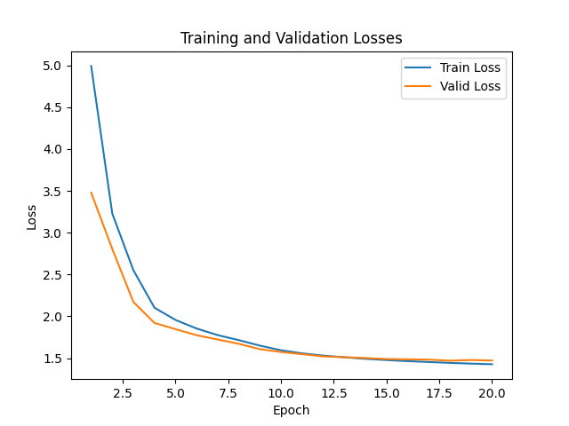
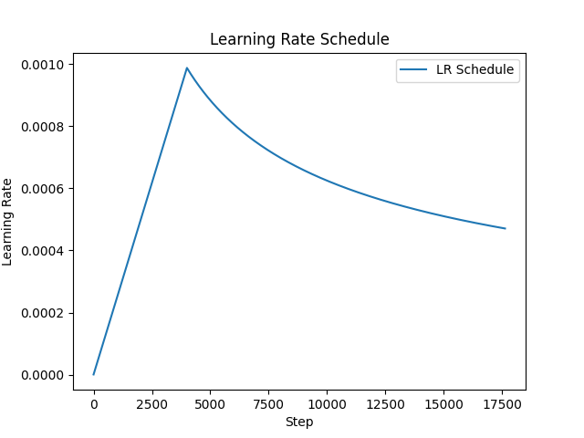
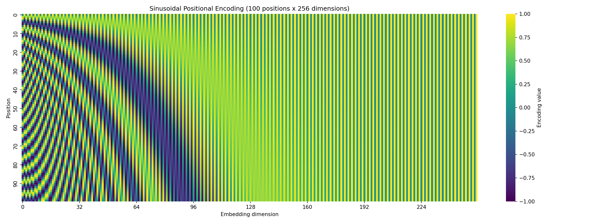
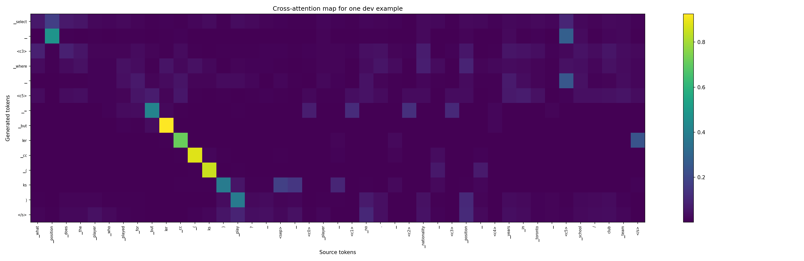
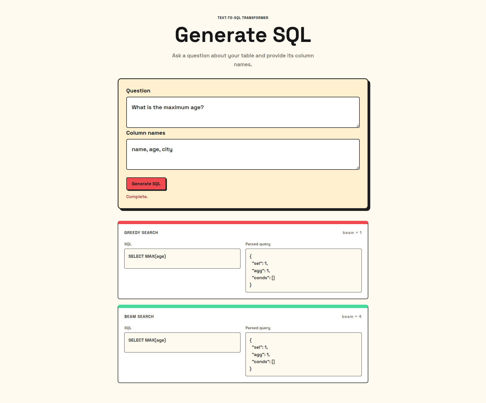

# Text-to-SQL Transformer

An encoder-decoder Transformer that converts natural-language questions and
table column names into WikiSQL logical-form queries. The project includes
data preparation, SentencePiece tokenization, model training, greedy and beam
search decoding, WikiSQL evaluation, attention visualization, and a FastAPI
web application.

## Features

- Transformer encoder-decoder implemented from scratch with:
  - Token and sinusoidal positional embeddings
  - Multi-head self-attention and cross-attention
  - Padding and causal masks
  - Residual connections, layer normalization, and feed-forward networks
- WikiSQL-compatible target representation:
  ```text
  select count <c3> where <c1> = value
  ```
- Greedy decoding with `beam_size=1`
- Beam search decoding with `beam_size=4`
- Official WikiSQL logical-form and execution evaluation
- Component accuracy reports for selected column, aggregation, and `WHERE`
  clauses
- Decoder cross-attention and positional-encoding heatmaps
- FastAPI interface showing greedy and beam predictions, including:
  - Human-readable SQL
  - Parsed WikiSQL query dictionary

## Project structure

```text
text-to-sql-transformer/
├── app/
│   ├── main.py                 # FastAPI application and routes
│   ├── inference.py            # Model loading and web inference
│   ├── templates/index.html    # Web interface
│   └── static/
│       ├── style.css           # Frontend styles
│       └── app.js              # Frontend API calls and rendering
├── model/
│   ├── embeddings.py           # Token and positional embeddings
│   ├── attention.py            # Multi-head attention
│   ├── layers.py               # Encoder and decoder layers
│   └── transformer.py          # Complete Transformer model
├── scripts/
│   ├── download_data.sh        # Download WikiSQL data
│   ├── data_prep.py            # Build source-target training pairs
│   ├── tokenizer.py            # Train SentencePiece tokenizer
│   ├── dataset.py              # Dataset, padding, and dataloaders
│   ├── check_starter.py        # Small data/model smoke test
│   ├── train.py                # Training and validation
│   ├── decode.py               # Greedy and beam decoding
│   └── evaluate_model.py       # Metrics, reports, and attention plots
├── WikiSQL/                    # WikiSQL evaluator and data
├── artifacts/
│   ├── dataset/                # Generated JSONL training pairs
│   ├── tokenizer/              # SentencePiece model
│   └── checkpoints/            # Saved model checkpoints
├── results/                    # Predictions, reports, and figures
├── requirements.txt
└── README.md
```

## Installation

Python 3.10 or newer is recommended.

```bash
git clone <repository-url>
cd text-to-sql-transformer

python3 -m venv .venv
source .venv/bin/activate
python -m pip install --upgrade pip
python -m pip install -r requirements.txt
```

For Google Colab, run the installation from the repository root:

```python
%cd /content/text-to-sql-transformer
!python -m pip install -r requirements.txt
```

## Prepare WikiSQL data

If the WikiSQL data is not already present, download it first:

```bash
chmod +x scripts/download_data.sh
./scripts/download_data.sh
```

Create source-target pairs for the train, development, and test splits:

```bash
python -m scripts.data_prep
```

This creates:

```text
artifacts/dataset/train_pairs.jsonl
artifacts/dataset/dev_pairs.jsonl
artifacts/dataset/test_pairs.jsonl
```

Train the SentencePiece tokenizer:

```bash
python -m scripts.tokenizer
```

Run the starter smoke test:

```bash
python -m scripts.check_starter
```

## Train the model

Start training with:

```bash
python -m scripts.train
```

The training script automatically selects CUDA when available and otherwise
uses the CPU. It writes checkpoints to:

```text
artifacts/checkpoints/
```

It also writes dataset and training reports to `results/` and the positional
encoding heatmap to:

```text
results/figures/positional_encoding_heatmap.png
```

The main model configuration is defined in `scripts/train.py`:

```text
batch size: 64
d_model: 256
attention heads: 4
encoder/decoder layers: 3
feed-forward dimension: 1024
maximum sequence length: 512
dropout: 0.1
```

## Generate predictions

After training, generate all four prediction files:

```bash
python -m scripts.decode
```

The decoder writes:

```text
results/dev_greedy.jsonl
results/dev_beam.jsonl
results/test_greedy.jsonl
results/test_beam.jsonl
```

Each valid prediction has the form:

```json
{
  "query": {
    "sel": 3,
    "agg": 0,
    "conds": [[5, 0, "Butler CC (KS)"]]
  }
}
```

If a prediction cannot be parsed, the decoder writes:

```json
{"error": "parse"}
```

## Evaluate the model

Run evaluation after the four prediction files have been generated:

```bash
python -m scripts.evaluate_model
```

The evaluator runs the official WikiSQL evaluator for all four combinations:

| Split | Decoding |
|---|---|
| Dev | Greedy |
| Dev | Beam search, `beam_size=4` |
| Test | Greedy |
| Test | Beam search, `beam_size=4` |

Reports are saved to:

```text
results/official_metrics.md
results/component_accuracy.md
results/figures/cross_attention_map.png
```

The evaluator also normalizes blank or malformed prediction lines as parse
errors so one invalid JSONL row does not abort the complete evaluation.

## Results

The generated Markdown reports are available here:

- [Official metrics](./results/official_metrics.md)
- [Component accuracy](./results/component_accuracy.md)
- [Dataset statistics](./results/data.md)
- [Training summary](./results/model_training.md)

### Official metrics

| Split | Decoding | Logical form (%) | Execution (%) | Parse failures (%) |
|---|---|---:|---:|---:|
| Dev | Greedy | 61.49 | 68.10 | 1.15 |
| Dev | Beam (`beam_size=4`) | 61.69 | 68.41 | 1.18 |
| Test | Greedy | 61.43 | 67.74 | 1.22 |
| Test | Beam (`beam_size=4`) | 37.46 | 41.88 | 1.19 |

### Component accuracy

The following component results are calculated on the development set using
beam search:

| Component | Accuracy (%) |
|---|---:|
| Selected column | 90.61 |
| Aggregation | 88.74 |
| `WHERE` clause | 40.87 |

### Dataset and training summary

See the complete generated reports:

- [Dataset statistics](./results/data.md)
- [Training summary](./results/model_training.md)

### Figures

#### Training loss



#### Learning-rate schedule



#### Positional encoding



#### Decoder cross-attention



#### FastAPI frontend



## Run the web application

The FastAPI app loads the best checkpoint and exposes both decoding methods
for each request:

```bash
uvicorn app.main:app --reload
```

Open <http://127.0.0.1:8000> in a browser. Enter:

1. A natural-language question.
2. Comma-separated or newline-separated column names.

The page displays the results vertically:

- **Greedy search**: `beam_size=1`
- **Beam search**: `beam_size=4`

For each prediction, the interface shows the human-readable SQL and parsed
query side by side.

The API endpoint is:

```text
POST /api/generate
```

Example request:

```json
{
  "question": "What is the maximum age?",
  "columns": ["name", "age", "city"]
}
```

## Device and checkpoint notes

- CUDA is used automatically when `torch.cuda.is_available()` is true.
- Model checkpoints are loaded from:
  `artifacts/checkpoints/best.pt`.
- The web application requires a trained checkpoint and tokenizer at:
  `artifacts/tokenizer/sql_sp.model`.
- Prediction token IDs must be passed through `model.encode()` and
  `model.decode()` so token embeddings are applied correctly.

## Common commands

```bash
# Prepare data and tokenizer
python -m scripts.data_prep
python -m scripts.tokenizer

# Validate the starter pipeline
python -m scripts.check_starter

# Train
python -m scripts.train

# Decode dev and test sets
python -m scripts.decode

# Generate metrics and figures
python -m scripts.evaluate_model

# Start the web application
uvicorn app.main:app --reload
```
